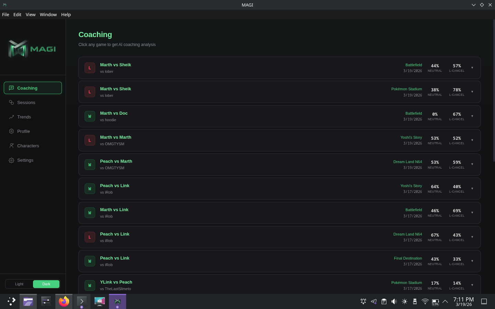
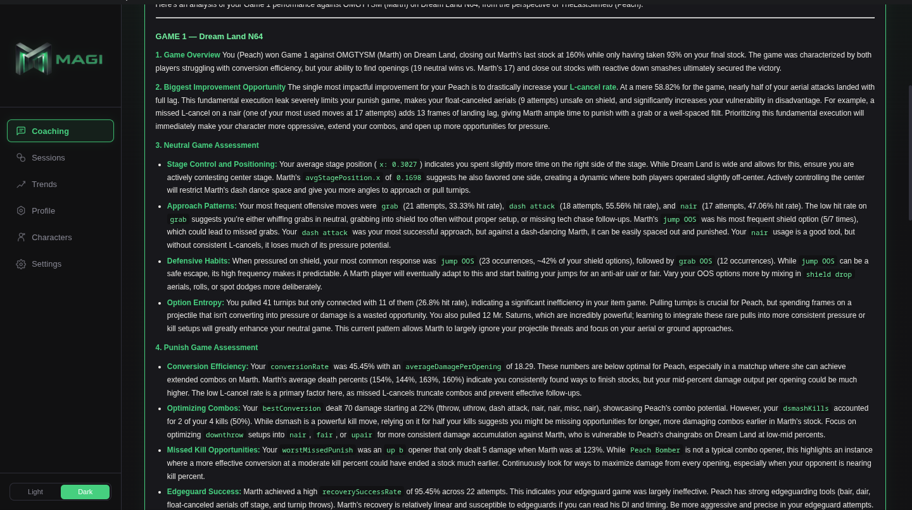
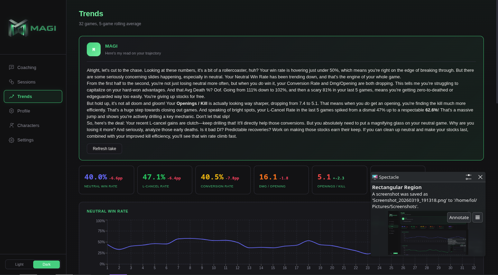
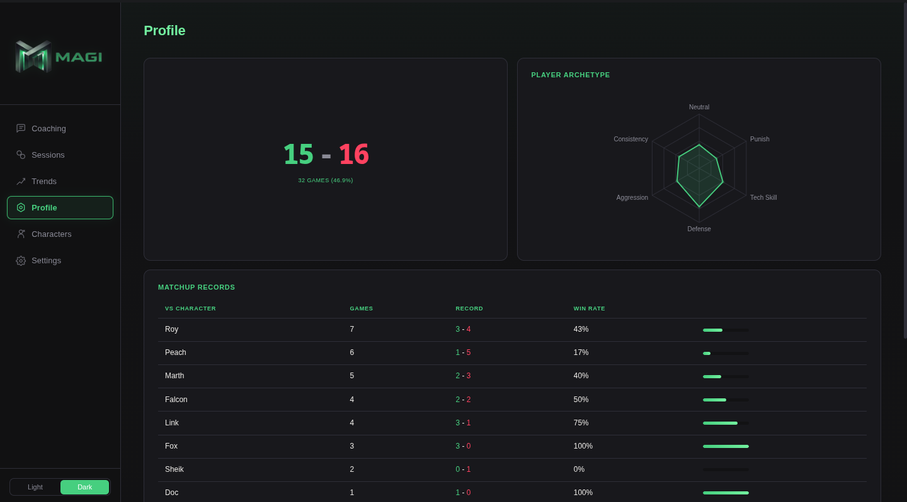
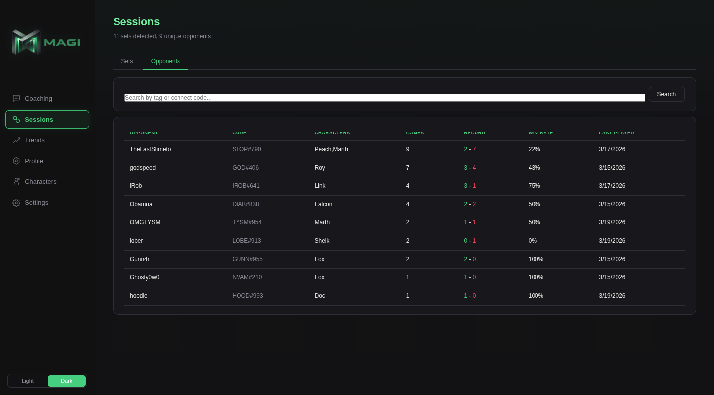
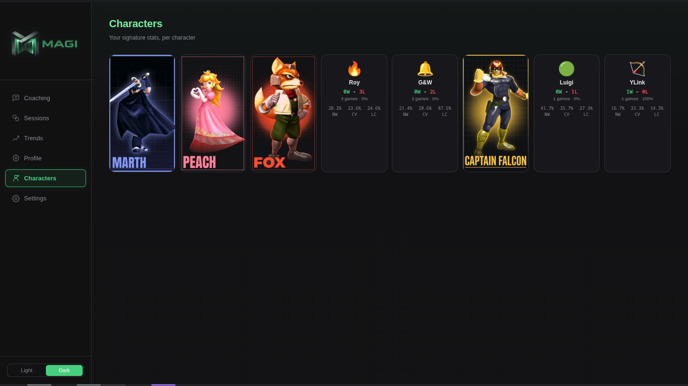
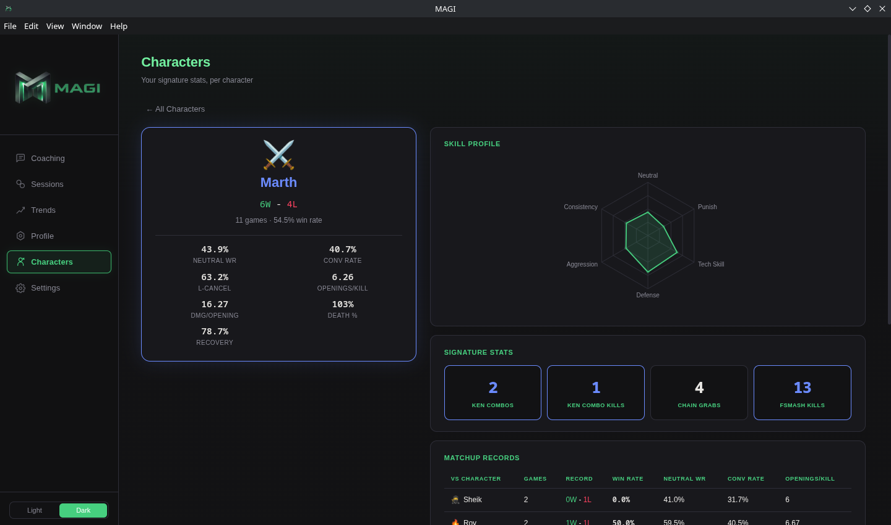

# MAGI — Melee Analysis through Generative Intelligence

AI-powered Melee coaching from your Slippi replays.

Import your `.slp` files, get personalized coaching analysis from an LLM, track your stats over time, and spot trends across sessions. No other tool in the Melee ecosystem does this.

---[Screencast_20260319_190122.webm](https://github.com/user-attachments/assets/e41e7616-ed56-41b9-aa28-3ef38f0d0d97)

## Screenshots

### Coaching — Click any game for AI analysis


### AI Coaching Analysis — Expanded


### Trends — Line charts with MAGI commentary


### Profile — Player radar chart and matchup records


### Sessions — Opponent history


### Characters — Grid view with card art


### Characters — Detail view with signature stats


---

## What it does

**Click a game, get coached.** MAGI parses your Slippi replay data, computes detailed stats (neutral win rate, L-cancel rate, conversion efficiency, habit patterns, recovery success, and more), then sends structured context to an LLM that returns specific, actionable coaching feedback — not generic advice, but observations grounded in *your* data.

**Track your trajectory.** Every game you import gets stored locally. Over time, MAGI shows you trends: is your neutral game improving? Are your ledge options getting predictable? Are you performing worse in game 3 of a set? Line charts, rolling averages, and AI commentary on your trajectory.

**Know your matchups.** Win/loss records by character, by stage, by opponent. Search your history against any player. Auto-detected sets with scores.

**Character-specific stats.** Fox waveshine combos, Falco pillar counts, Marth Ken combos, Sheik tech chases, Falcon knee kills, Puff rest stats, Peach turnip tracking — signature stats for 20+ characters, aggregated across all your games.

## Features

- **Per-game AI coaching** — click any game in the Coaching tab, get a full analysis with Melee-specific terminology and actionable drills
- **Stat tracking** — neutral win rate, L-cancel rate, openings per kill, damage per opening, conversion rate, recovery success, death percent, and more
- **Trend charts** — 5-game rolling averages for every tracked stat with visual line graphs
- **MAGI trend commentary** — AI personality that reacts to your trajectory with blunt, witty feedback
- **Player radar chart** — six-axis archetype visualization (Neutral, Punish, Tech Skill, Defense, Aggression, Consistency)
- **Character pages** — per-character stats, radar charts, signature stats, matchup and stage records with character card art
- **Set detection** — auto-groups games against the same opponent within 15 minutes
- **Opponent history** — searchable by tag or connect code, shows record/characters/last played
- **Matchup & stage records** — win rate bars for every character and stage you've played
- **Replay deduplication** — SHA-256 hash on import, never imports the same file twice
- **Analysis caching** — coaching results stored in the database, clicking the same game twice costs $0
- **Multi-LLM provider** — OpenRouter (full model catalog), Gemini direct, Anthropic direct, OpenAI direct, or local models via Ollama/LM Studio
- **Rate-limited API queue** — LLM calls processed one at a time with backoff, handles 429 rate limits gracefully
- **File watcher** — point at your Slippi replay folder, auto-imports new games as you play
- **Light/dark mode** — clean toggle in the sidebar
- **Local-first** — your data stays on your machine, no account needed, no server

## Tech Stack

- **Electron** + **React** + **TypeScript** — cross-platform desktop app
- **slippi-js** — parses `.slp` replay files
- **better-sqlite3** — local database for stats, analyses, and config
- **Multi-LLM support** — DeepSeek V3 via OpenRouter (default), plus Gemini, Claude, GPT-4o, and local models (Ollama/LM Studio)
- **Recharts** — trend line charts and radar chart
- **Vite** — frontend bundling and dev server
- **chokidar** — file system watching for auto-import
- **electron-updater** — over-the-air updates for packaged builds

## Getting Started

### Prerequisites

- [Node.js](https://nodejs.org/) 18+
- Slippi replay files (`.slp`)

### Install

```bash
git clone https://github.com/Bloodshed-Rain/MAGI.git
cd MAGI
npm install
npx electron-rebuild
```

### Run the app

```bash
npm run dev
```

### First-time setup

1. Open the app
2. Go to **Settings**
3. Enter your display name / tag
4. Browse to your Slippi replay folder
5. Choose an AI model and enter your API key (OpenRouter recommended — one key for all models)
6. Click **Save Settings**, then **Import All**
7. Go to the **Coaching** tab and click any game

### CLI usage (optional)

The analysis pipeline also works from the command line:

```bash
# Analyze a single replay
npx tsx src/pipeline.ts path/to/game.slp --target YourTag

# Watch for new replays
npx tsx src/watcher.ts /path/to/replays --target YourTag
```

## Architecture

```
.slp files
    |
    v
[slippi-js parser] --> GameSummary + DerivedInsights (JSON)
    |
    +--> [SQLite] --> persistent stats, trends, opponent history
    |
    +--> [LLM Queue] --> rate-limited API calls (OpenRouter/Gemini/Claude/OpenAI/local)
              |
              v
          [Coaching Analysis] --> cached in DB, rendered as markdown
```

Key modules:
- `src/pipeline.ts` — data pipeline: slippi-js parsing, stat computation, habit detection, character-specific stats, prompt assembly
- `src/llm.ts` — multi-provider LLM abstraction with retry, rate-limit handling, and fetch timeout
- `src/db.ts` — SQLite schema, queries, trend/matchup/opponent/set detection
- `src/replayAnalyzer.ts` — deduplicated analysis flow with caching
- `src/llmQueue.ts` — rate-limited queue for LLM API calls
- `src/importer.ts` — batch import with SHA-256 dedup and per-file error recovery
- `src/watcher.ts` — chokidar file watcher for auto-import
- `src/main/index.ts` — Electron main process, IPC handlers
- `src/renderer/` — React frontend (pages, components, themes)

## Cost

Not charging anything at this point. If enough people use it to warrant it, I'll implement something to cover API costs. Local LLM models and BYOK will always be supported.

## Roadmap

- [x] Multi-provider LLM support (OpenRouter, Claude, GPT-4o, Gemini, local)
- [x] Local model support (Ollama / LM Studio)
- [x] Character-specific signature stats (20+ characters)
- [x] Character card art and per-character detail pages
- [ ] Worker thread parsing for non-blocking bulk imports
- [ ] Dolphin HUD mode (wrap around the emulator window)
- [ ] Practice plan tracking with progress indicators
- [ ] Shareable coaching reports

## License

[MIT](LICENSE)
