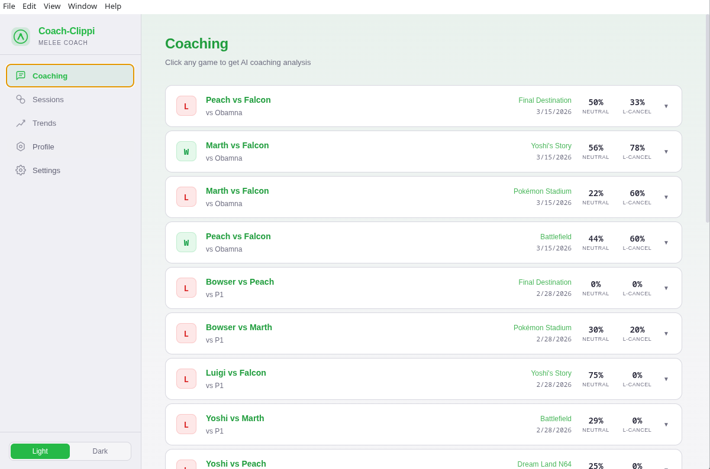
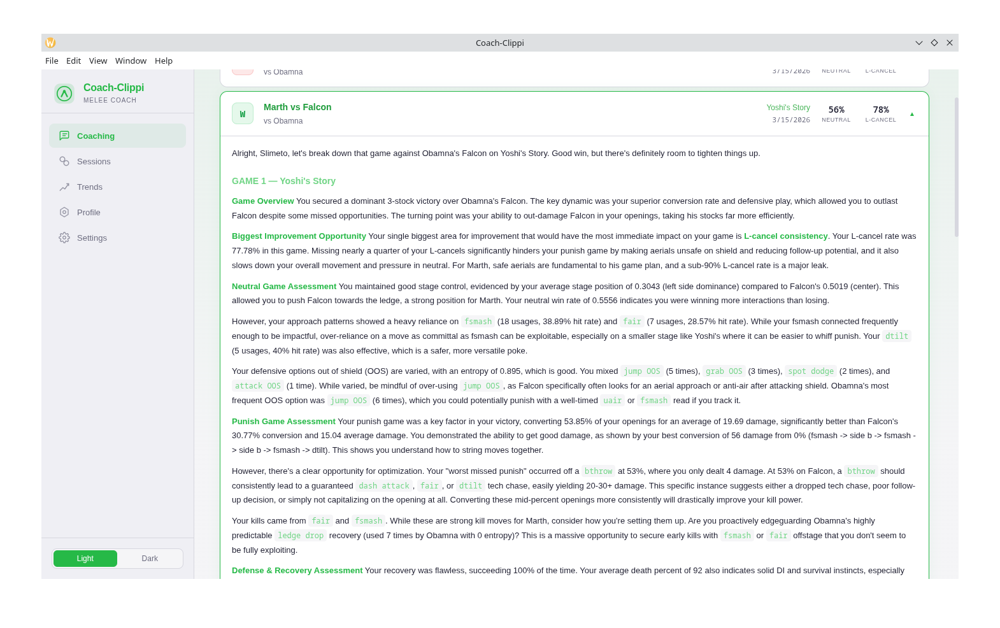
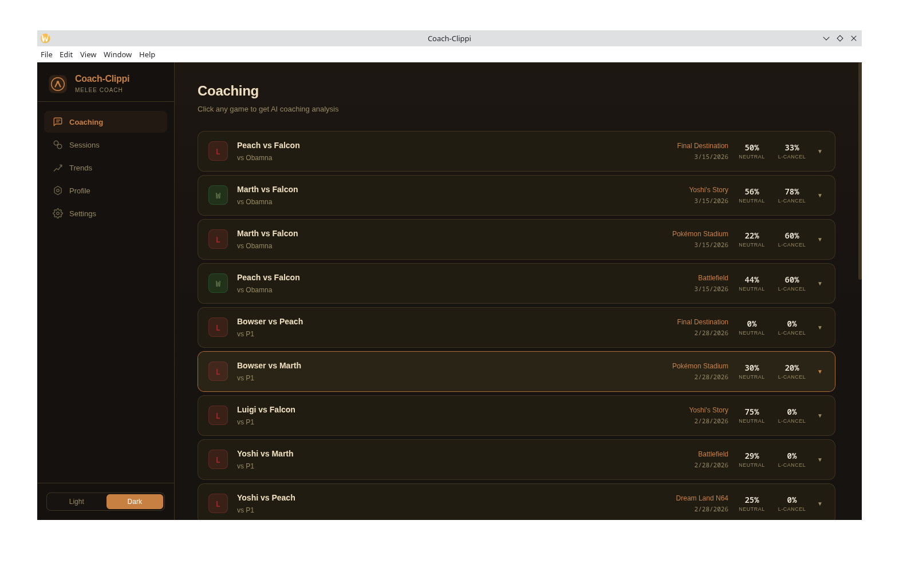
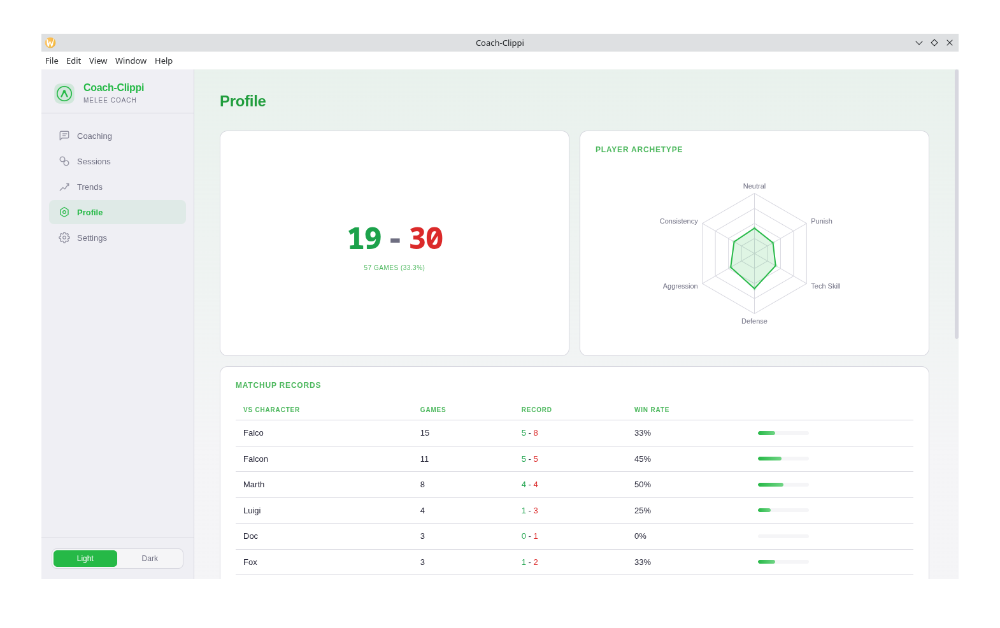
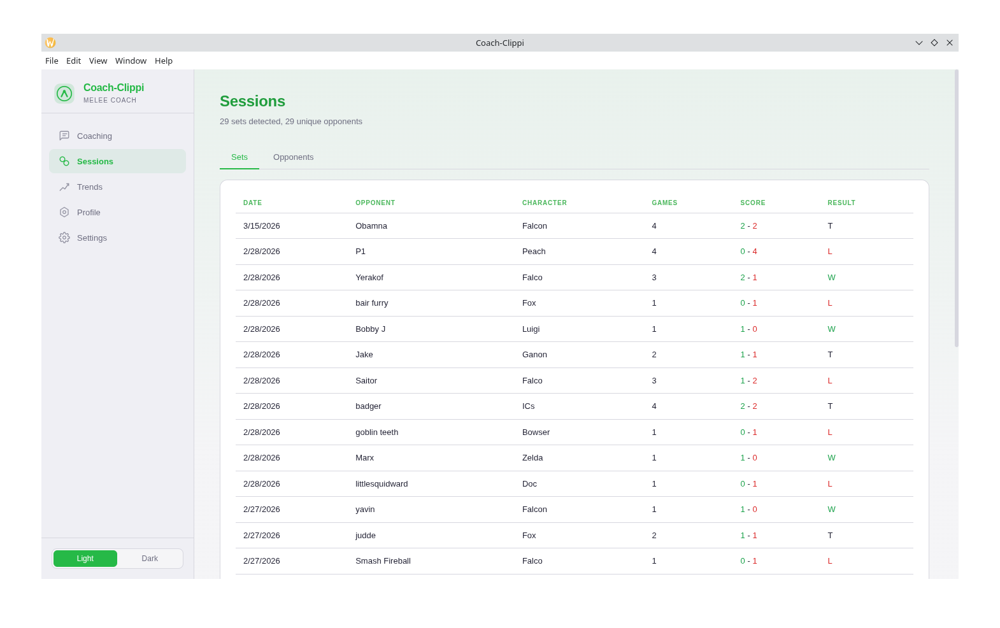
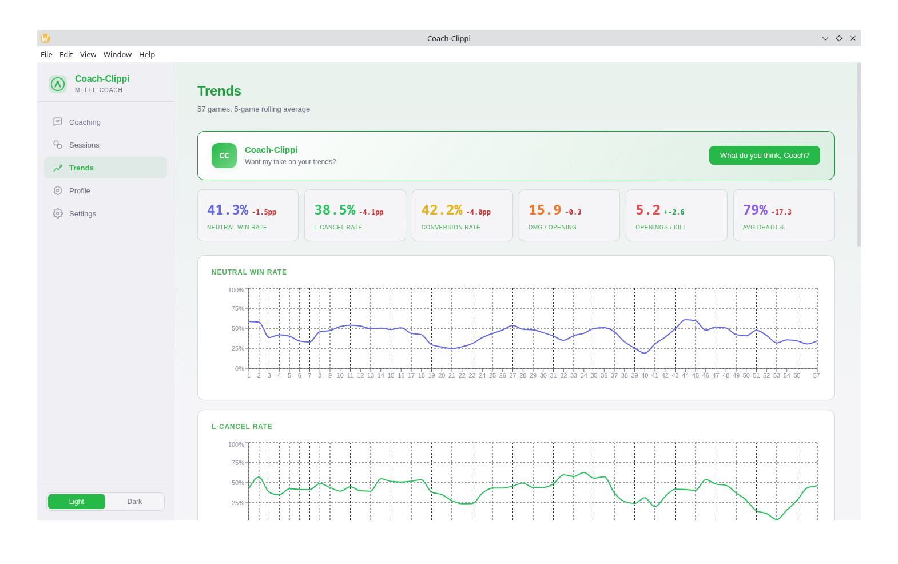
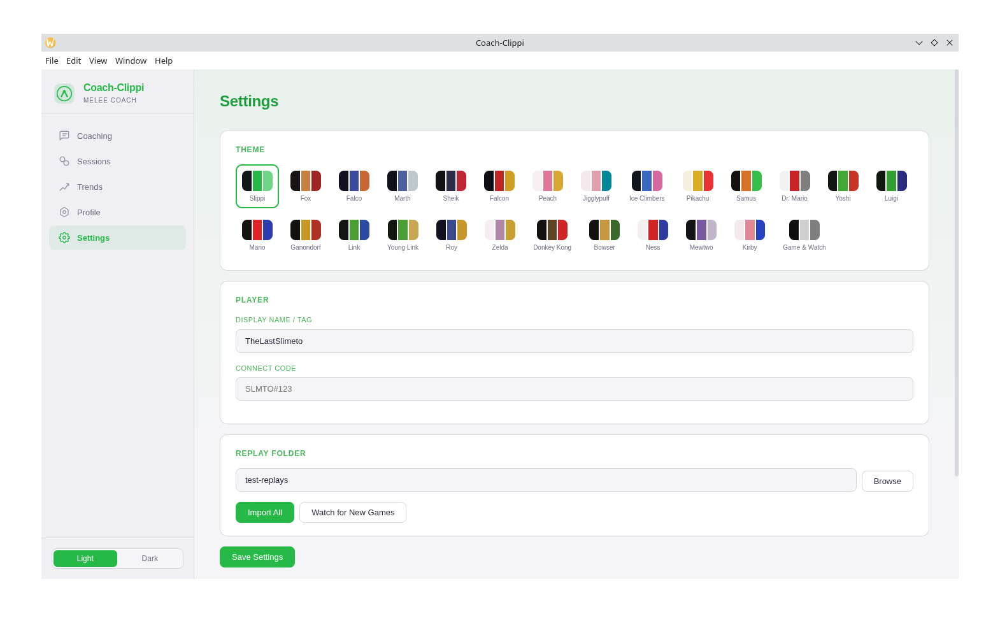
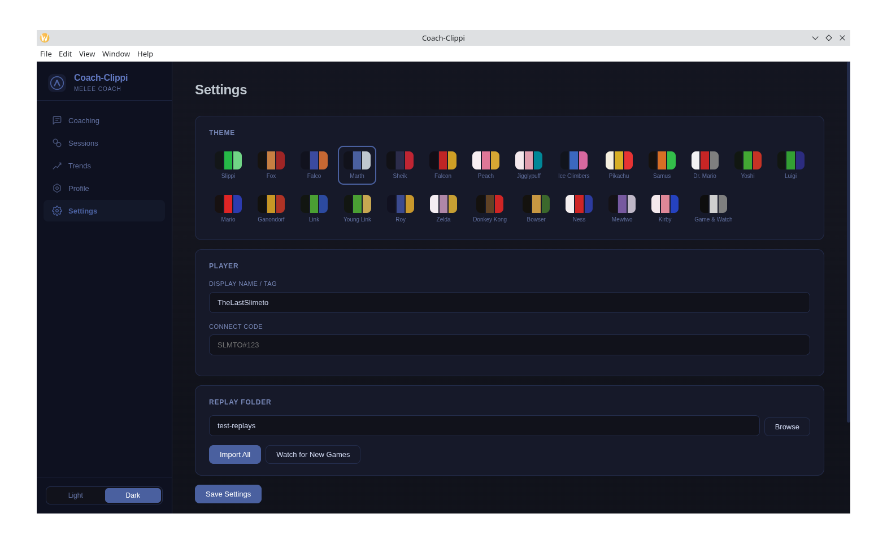

# Coach-Clippi

AI-powered Melee coaching from your Slippi replays.

Import your `.slp` files, get personalized coaching analysis from an LLM, track your stats over time, and spot trends across sessions. No other tool in the Melee ecosystem does this.

## Screenshots

### Coaching — Click any game for AI analysis


### AI Coaching Analysis — Expanded


### Coaching — Dark mode (Fox theme)


### Profile — Player radar chart and matchup records


### Sessions — Auto-detected sets and opponent history


### Trends — Line charts with Coach-Clippi commentary


### Settings — 26 character themes with light/dark toggle



---

## What it does

**Click a game, get coached.** Coach-Clippi parses your Slippi replay data, computes detailed stats (neutral win rate, L-cancel rate, conversion efficiency, habit patterns, recovery success, and more), then sends structured context to an LLM that returns specific, actionable coaching feedback — not generic advice, but observations grounded in *your* data.

**Track your trajectory.** Every game you import gets stored locally. Over time, Coach-Clippi shows you trends: is your neutral game improving? Are your ledge options getting predictable? Are you performing worse in game 3 of a set? Line charts, rolling averages, and AI commentary on your trajectory.

**Know your matchups.** Win/loss records by character, by stage, by opponent. Search your history against any player. Auto-detected sets with scores.

**Make it yours.** 26 character-themed UI skins, each based on the character's actual default costume palette. Ganondorf's theme is dark and heavy. Jigglypuff's is light and pink. Fox is warm tawny and red. Every theme has distinct title, label, and body text colors.

## Features

- **Per-game AI coaching** — click any game in the Coaching tab, get a full analysis with Melee-specific terminology and actionable drills
- **Stat tracking** — neutral win rate, L-cancel rate, openings per kill, damage per opening, conversion rate, recovery success, death percent, and more
- **Trend charts** — 5-game rolling averages for every tracked stat with visual line graphs
- **Coach-Clippi trend commentary** — AI personality that reacts to your trajectory with blunt, witty feedback
- **Player radar chart** — six-axis archetype visualization (Neutral, Punish, Tech Skill, Defense, Aggression, Consistency)
- **Set detection** — auto-groups games against the same opponent within 15 minutes
- **Opponent history** — searchable by tag or connect code, shows record/characters/last played
- **Matchup & stage records** — win rate bars for every character and stage you've played
- **Replay deduplication** — SHA-256 hash on import, never imports the same file twice
- **Analysis caching** — coaching results stored in the database, clicking the same game twice costs $0
- **Rate-limited API queue** — LLM calls processed one at a time with delays, prevents 429 errors on batch imports
- **File watcher** — point at your Slippi replay folder, auto-imports new games as you play
- **26 character themes** — Slippi green default plus Fox, Falco, Marth, Sheik, Captain Falcon, Peach, Jigglypuff, Ice Climbers, Pikachu, Samus, Dr. Mario, Yoshi, Luigi, Mario, Ganondorf, Link, Young Link, Roy, Zelda, Donkey Kong, Bowser, Ness, Mewtwo, Kirby, and Mr. Game & Watch — each based on the character's actual default costume palette
- **Light/dark mode** — available on every theme
- **Local-first** — your data stays on your machine, no account needed, no server

## Tech Stack

- **Electron** + **React** + **TypeScript** — cross-platform desktop app
- **slippi-js** — parses `.slp` replay files
- **better-sqlite3** — local database for stats, analyses, and config
- **Gemini 2.5 Flash** — default LLM for coaching analysis (~$0.01-0.03 per game)
- **Recharts** — trend line charts and radar chart
- **Vite** — frontend bundling and dev server
- **chokidar** — file system watching for auto-import
- **electron-updater** — over-the-air updates for packaged builds

## Getting Started

### Prerequisites

- [Node.js](https://nodejs.org/) 18+
- Slippi replay files (`.slp`)

### Install

```bash
git clone https://github.com/Bloodshed-Rain/Coach-Clippi.git
cd Coach-Clippi
npm install
npx electron-rebuild
```

### Run the app

```bash
npm run dev
```

### First-time setup

1. Open the app
2. Go to **Settings**
3. Enter your display name / tag
4. Browse to your Slippi replay folder
5. Click **Save Settings**, then **Import All**
6. Go to the **Coaching** tab and click any game

### CLI usage (optional)

The analysis pipeline also works from the command line:

```bash
# One-time setup
npx tsx src/setup.ts --tag YourTag --folder /path/to/replays

# Import replays
npx tsx src/import-cli.ts

# Import + get AI coaching
npx tsx src/import-cli.ts --analyze

# View stats
npx tsx src/stats.ts

# View opponent history
npx tsx src/stats.ts opponents SomePlayer

# Watch for new replays
npx tsx src/watcher.ts
```

## Architecture

```
.slp files
    |
    v
[slippi-js parser] --> GameSummary + DerivedInsights (JSON)
    |
    +---> [SQLite] --> persistent stats, trends, opponent history
    |
    +---> [LLM Queue] --> rate-limited Gemini API calls
              |
              v
          [Coaching Analysis] --> cached in DB, rendered as markdown
```

Key modules:
- `src/pipeline.ts` — data pipeline: slippi-js parsing, stat computation, habit detection, prompt assembly
- `src/db.ts` — SQLite schema, queries, trend/matchup/opponent/set detection
- `src/replayAnalyzer.ts` — deduplicated analysis flow with caching
- `src/llmQueue.ts` — rate-limited queue for LLM API calls
- `src/importer.ts` — batch import with SHA-256 dedup
- `src/watcher.ts` — chokidar file watcher for auto-import
- `src/main/index.ts` — Electron main process, IPC handlers
- `src/renderer/` — React frontend (pages, components, themes)

## Cost

Im not charging any money at this point, but in the future when/if enough people use it to warrant it I will implement some type of way to make the money back for the API Calls. But local LLM models/BYOK will also be supported.

## Roadmap

- [ ] Worker thread parsing for non-blocking bulk imports
- [ ] Dolphin HUD mode (wrap around the emulator window)
- [ ] Practice plan tracking with progress indicators
- [ ] Shareable coaching reports
- [ ] Local model support (Ollama / LM Studio)
- [ ] Multi-provider LLM support (Claude, GPT-4o, local)

## License

[MIT](LICENSE)
